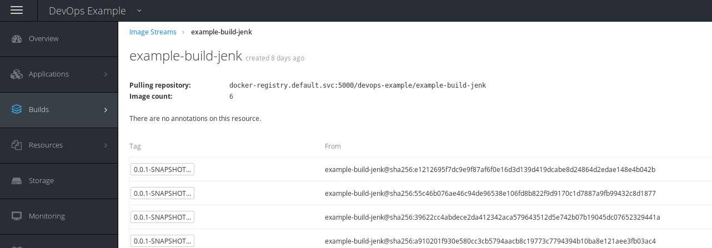

# Extracting built artefacts from the SIAB OpenShift cluster


The Jenkins build Pipeline in the devops-example project will tag and push built images to the internal OpenShift registry.

The basic steps follow on how to extract an image from the internal OpenShift docker registry to use elsewhere in projects. 

## images visible in the OCP console

In the OpenShift console select your project (e.g.  _devops-example_ ) and click on the Builds | Images menu. This will display the Image Streams available in the project.

Select the Image Stream (e.g.  _example-build-jenk_ ) to display the tagged images in the stream:



The tagged images are displayed and further information is available by selecting one

The same basic information is available via the command line:

```
oc project devops-example  # switch to the project

oc get is  # display the image streams
NAME                  DOCKER REPO                                                           TAGS                                                    UPDATED
example-build-jenk    docker-registry.default.svc:5000/devops-example/example-build-jenk    0.0.1-SNAPSHOT-10,latest,0.0.1-SNAPSHOT-9 + 3 more...   23 hours ago

oc get istag  # display the tagged images
NAME                                   DOCKER REF                                                                                                                                    UPDATED
example-build-jenk:0.0.1-SNAPSHOT-6    docker-registry.default.svc:5000/devops-example/example-build-jenk@sha256:55c46b076ae46c94de96538e106fd8b822f9d9170c1d7887a9fb99432c8d1877    3 days ago
example-build-jenk:0.0.1-SNAPSHOT-7    docker-registry.default.svc:5000/devops-example/example-build-jenk@sha256:39622cc4abdece2da412342aca579643512d5e742b07b19045dc07652329441a    3 days ago
example-build-jenk:0.0.1-SNAPSHOT-8    docker-registry.default.svc:5000/devops-example/example-build-jenk@sha256:a910201f930e580cc3cb5794aacb8c19773c7794394b10ba8e121aee3fb03ac4    2 days ago
example-build-jenk:0.0.1-SNAPSHOT-9    docker-registry.default.svc:5000/devops-example/example-build-jenk@sha256:dc4ccb654da628aee751c3f1b4b6c5aaabdbb1cf00d0e5deeb826e84cf8c4c5c    29 hours ago
example-build-jenk:latest              docker-registry.default.svc:5000/devops-example/example-build-jenk@sha256:e1212695f7dc9e9f87af6f0e16d3d139d419dcabe8d24864d2edae148e4b042b    23 hours ago
example-build-jenk:0.0.1-SNAPSHOT-10   docker-registry.default.svc:5000/devops-example/example-build-jenk@sha256:e1212695f7dc9e9f87af6f0e16d3d139d419dcabe8d24864d2edae148e4b042b    23 hours ago
```

## exporting images

When you know which tagged image you wish to export this is a simple way to extract it from the internal docker registry for exporting


```
# login to openshift
oc login -u developer -p developer

# save the token that identifies your session
TOKEN=$(oc whoami -t)

#login to the internal registry
docker login -u developer -p $TOKEN docker-registry.default.svc.cluster.local:5000

# extract the required image

# save to a tar file that can be exported via the file system 
docker save docker-registry.default.svc.cluster.local:5000/<project>/<image repo name>:<tag> -o example-build-jenk-10.tar
e.g.
docker save docker-registry.default.svc.cluster.local:5000/devops-example/example-build-jenk:0.0.1-SNAPSHOT-10 -o example-build-jenk-10.tar


# logout of the internal registry
docker logout -u developer -p $TOKEN docker-registry.default.svc.cluster.local:5000

# then load it to a registry where you need it
docker load --input example-build-jenk-10.tar


```

## using an image to create an application in a project

Once the image has been exported and tagged as required the OpenShift CLI command new-app can be used to turn an image into a running pod

```
oc new-project test-example  # create and switch to the new project

oc new-app <registry address>/<repository>/<image name>:<image tag>

# e.g.

oc new-app docker-registry.default.svc.cluster.local:5000/devops-example/example-build-jenk:0.0.1-SNAPSHOT-10

# as we are ceating docker images we can even test them with docker

docker run <registry address>/<repository>/<image name>:<image tag> 

```


