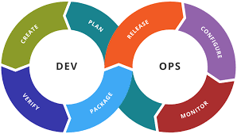
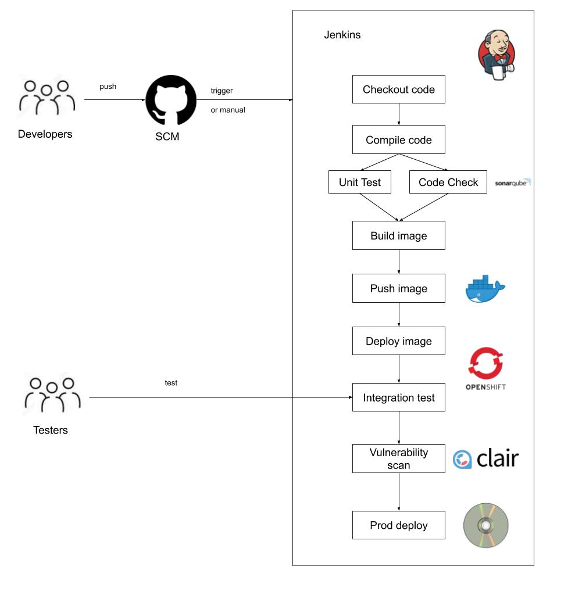

# DevOps Example Project for Thales Stack-in-a-Box Deployment

This project is hosted in git and is intended to demonstrate how DevOps practices can be achieved in the Thales Stack-in-a-Box environment

[See SIAB_README.md for the Stack-in-a-Box project](SIAB_README.md) 

## What is DevOps?

- “DevOps is a set of practices that combines software development (Dev) and information-technology operations (Ops) which aims to shorten the systems development life cycle and provide continuous delivery with high software quality” [Wikipedia]

- Agile methodologies are often part of DevOps

- Continuous Integration (CI) and Continuous Delivery (CD) form part of it too 

- Automation is a key aspect of DevOps

- DevOps is often referred to as a culture rather than a particular set of tools

--------------------------------

## Jenkins Pipelines

- Jenkins is an open-source automation server written in Java
- It is used for Continuous Integration 
- Consists of a set of steps that run to build, test, and deploy code
- The latest Jenkins build servers use Pipelines to automate the steps
- Jenkins servers can run in containers under OpenShift
- Jenkins can orchestrate th euse of other tools such as SonarQube and Clair - which can also run in OpenShift

-------------------------------
## The Example Project

This project is intended to represent an approach to CI/CD using a Jenkins build server hosted in an OpenShift container

The Jenkinsfile at the top level of the project controls the order of the build and will be explained below along with instructions for running the project

This project is intended to build with the Jenkinsfile at the top level which provides a CI-CD pipeline  

### Reference Documentation for included packages

For further reference, please consider the following sections:

* [Official Apache Maven documentation](https://maven.apache.org/guides/index.html)
* [Spring Boot Maven Plugin Reference Guide](https://docs.spring.io/spring-boot/docs/2.2.2.RELEASE/maven-plugin/)
* [Spring for Apache Kafka](https://docs.spring.io/spring-boot/docs/2.2.2.RELEASE/reference/htmlsingle/#boot-features-kafka)
* [Spring Web](https://docs.spring.io/spring-boot/docs/2.2.2.RELEASE/reference/htmlsingle/#boot-features-developing-web-applications)