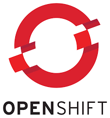

# DevOps Example Project for Thales Stack-in-a-Box Deployment

This project is hosted in git and is intended to demonstrate how DevOps practices can be achieved in the Thales Stack-in-a-Box environment

[See SIAB_README.md for the Stack-in-a-Box project](SIAB_README.md) 

## What is DevOps?

- “DevOps is a set of practices that combines software development (Dev) and information-technology operations (Ops) which aims to shorten the systems development life cycle and provide continuous delivery with high software quality” [Wikipedia]

- Agile methodologies are often part of DevOps

- Continuous Integration (CI) and Continuous Delivery (CD) form part of it too 

- Automation is a key aspect of DevOps

- DevOps is often referred to as a culture rather than a particular set of tools

--------------------------------

## Jenkins Pipelines

- Jenkins is an open-source automation server written in Java
- It is used for Continuous Integration 
- Consists of a set of steps that run to build, test, and deploy code
- The latest Jenkins build servers use Pipelines to automate the steps
- The pipeline is contained in a  _Jenkinsfile_
- Jenkins servers can run in containers under OpenShift
- Jenkins can orchestrate the use of other tools such as SonarQube and Clair - which can also run in OpenShift

--------------------------------------
## Default addresses and log-in details

*  _OpenShift_  - [http://ocp.thales.com:8443](http://ocp.thales.com:8443)  - developer / developer

*  _Gitea_  - [http://ocp.thales.com:3000](http://ocp.thales.com:3000)  - engineer / Passw0rd!

*  _Nexus_  - [http://ocp.thales.com:8081](http://ocp.thales.com:8081)  - admin / password in /opt/nexus/sonatype-work/nexus3/admin.password file

*  _Jenkins_  - [http://jenkins.ocp.thales.com](http://jenkins.ocp.thales.com)  - admin / password

*  _Sonarqube_  - [http://sonar-sonarqube.apps.ocp.thales.com](http://sonar-sonarqube.apps.ocp.thales.com)  - admin / admin

-------------------------------
## The Example Project

This project is intended to represent an approach to CI/CD using a Jenkins build server hosted in an OpenShift container

The  _Jenkinsfile_  at the top level of the project controls the order of the build and will be explained below along with instructions for running the project

### Project purpose

The project works on two levels. Apart from explaining how to create a continuous build pipeline the project is a Spring Boot Java application that integrates with a Kafka cluster running in OpenShift and adds messages to a Kafka topic.

In the full Stack-in-a-Box solution the project will be hosted in a Gitea server running in the OCP Virtual Machine. Deployed in the OpenShift cluster is a Jenkins server, a Sonarqube server, and a Kafka installation.

The various elements of the application are explained below:

### The Java Spring Boot Kafka application

#### Pre-requisites

* The java application assumes that a Kafka cluster is running in the OpenShift cluster at  *my-cluster-kafka-bootstrap.kafka.svc:9092*. This will be set up as part of the OCP machine build.

* application.yml in src/main/resources contains properties that are used by the main application to build the relationship with Kafka including the address of the bootstrap server and the name of the topic to be used  - *greeting-topic*

#### The Java application 

The main application is contained in the com.example.demo package under src/main/java

* ExampleApplication.java - this class defines the application sing the  _@SpringBootApplication_  annotation and defines the ProducerFactory and KafkaTemplate that will be used to send messages to the Kafka cluster

* Greeting.java - this class is a simple Data class that is used to define the greetings objects that will be sent to Kafka

* GreetingKafkaController - this class acts as a controller for the RESTful service using the  _@RestController_  annotation. This will take HTTP requests and turn them into greetings to be sent to Kafka. This class contains two RESTful mappings a GET and a POST mapping. The GET mapping is a dummy as the Kafka stream will be operating in real time and its listeners will receive messages as they are POSTed. The POST mapping will take an HTTP parameter and generate the greeting before sending it to Kafka using the Template defined in the main Application class.

### The Jenkins build pipeline

 

The order and steps of the build are defined in the  _Jenkinsfile_  at the top level of the project. This file represents a pipeline for Continuous Build and Deployment. The Jenkins server will interpret the steps in this file and manage the build accordingly. Refer to this file when reading the explanation below.

The Jenkins server within the OCP machine has been installed with the Gitea plug-in. By using this plug-in the pipeline can be ingested and web-hooks created so that when the git code is pushed from the IDE to the server a build will be triggered automatically. See below for extra set-up information with the Gitea plug-in

The steps in the pipeline are as follows:

* [check out]  - the first step is not visible as Jenkins will pull the code from git when the build is triggered whether manually or via a webhook

* environment  -  set up variables used in the pipeline

* First Stage  -  a dummy stage that just echoes some info about the build and environment variables

*  Test  -  runs automated tests via Maven command (currently no tests defined so this will pass) [ _uses Maven_ ]

*  Sonar  - runs a Maven target that invokes the Sonarqube scanner plug-in to analyse the code [ _uses Sonar scanner plug-in and invokes Sonarqube container_ ]

* Build App  - runs a Maven command to build the fat jar representing the Java application [ _uses Maven_ ]

* Create Builder  - this step checks to see if a source to image (s2i) Build Configuration (bc) already exists in the OpenShift project. If not it will create one. [ _uses OpenShift plug-in_ ]

* Build Image  - this step will use the Build Configuration and add the fat jar created earlier to create a new image for deployment. [ _uses OpenShift plug-in_ ]

* Create deployment config - this step checks to see if a Deployment Configuration (dc) already exists in the OpenShift project. If not it will create one. [ _uses OpenShift plug-in_ ]

* Tag image - this step tags the latest built image with a tag representing the Maven version combined with the Jenkins build number [ _uses OpenShift plug-in_ ]

* Rollout  - based on the deployment configuration this step rolls out the latest build as a deployed pod in the OpenShift cluster. Previous running pod will be stopped and replaced. [ _uses OpenShift plug-in_ ]

* Last stage - dummy stage

#### Feedback from the plug-ins

* The success or failure of the Jenkins build is automatically fed back to the gitea server by the Jenkins build process and is visible on the gitea console:

* The sonarqube analysis that is triggered by the Jenkins build can be linked via the sonarqube icon in the build history:

---------------------------------------------
### Extra configuration of the Jenkins server in the OCP virtual machine

Following the installation of the Jenkins and Sonarqube servers in containers in the OpenShift cluster further configuration is required as follows. This should have already been set up in the test environment. The following instructions are for completeness in this case

#### setup Gitea server for plug-in

* In the  _Jenkins console_ 

* Manage Jenkins | Configure System | Gitea Servers | add server

* name:  _gitea_
 

* server url:  _http://ocp.thales.com:3000_

* check  _manage hooks_  check-box

* add engineer/Passw0rd! as credentials 

#### setup Gitea organization

* In the  _Jenkins console_ 

* In main menu, click "New Item".

* Select "Gitea organization" as the item type

* In the "Gitea organzations" section, add a new credential and choose the engineer/******** created earlier

* In the "Owner" field, add 'engineer'

Jenkins will scan the gitea repo and find engineer's projects 

Jenkins will automatically look to see if the project has a Jenkinsfile and check it out and try to build it - also creates a webhook in gitea so that future pushes of code to the repository will trigger a new Jenkins build. This webhook is visible from the gitea console under Settings | Webhooks:

#### set up the Sonarqube  server in Jenkins

This assumes the Sonarqube server has already been installed in the OpenShift cluster

* _In the sonarqube console_  login as admin/admin [optionally create a new user for Jenkins] 

* | My Account | Security | Generate Tokens | name it 'Jenkins' and copy it to the clipboard

* In the  _Jenkins console_ 

* | Manage Jenkins | Configure System | SonarQube Servers | add SonarQube

* name:  _Sonar_

* server url:  _http://sonar-sonarqube.apps.ocp.thales.com_ 

* server token:  _token copied from sonarqube_ 

-------------------------------------

### Reference Documentation for included packages

The project was originally created using a Spring Boot Maven starter with Kafka support. The auto-generated documentation for this is below:

For further reference, please consider the following sections:

* [Official Apache Maven documentation](https://maven.apache.org/guides/index.html)
* [Spring Boot Maven Plugin Reference Guide](https://docs.spring.io/spring-boot/docs/2.2.2.RELEASE/maven-plugin/)
* [Spring for Apache Kafka](https://docs.spring.io/spring-boot/docs/2.2.2.RELEASE/reference/htmlsingle/#boot-features-kafka)
* [Spring Web](https://docs.spring.io/spring-boot/docs/2.2.2.RELEASE/reference/htmlsingle/#boot-features-developing-web-applications)